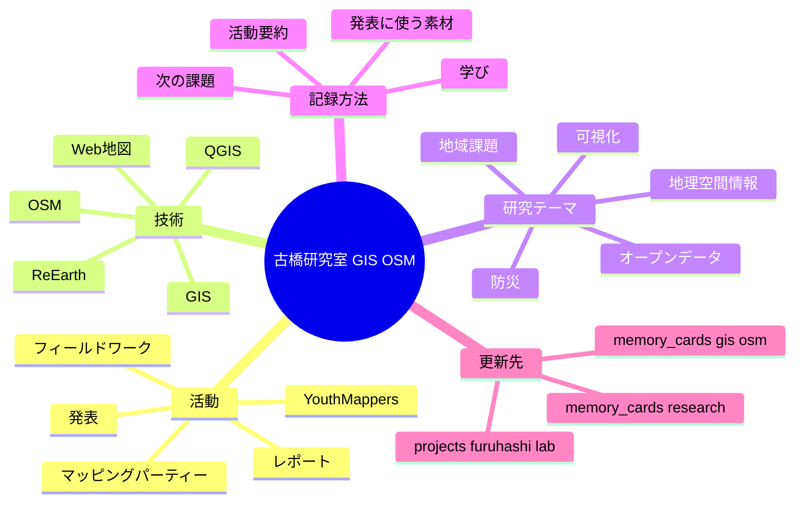

# Furuhashi Lab Mindmap

古橋研究室、GIS/OSM、YouthMappers関連の文脈です。

```mermaid
mindmap
  root((古橋研究室 GIS OSM))
    活動
      YouthMappers
      マッピングパーティー
      フィールドワーク
      発表
      レポート
    技術
      GIS
      OSM
      ReEarth
      QGIS
      Web地図
    研究テーマ
      地理空間情報
      オープンデータ
      防災
      地域課題
      可視化
    記録方法
      活動要約
      学び
      次の課題
      発表に使う素材
    更新先
      memory_cards gis osm
      memory_cards research
      projects furuhashi lab
```
