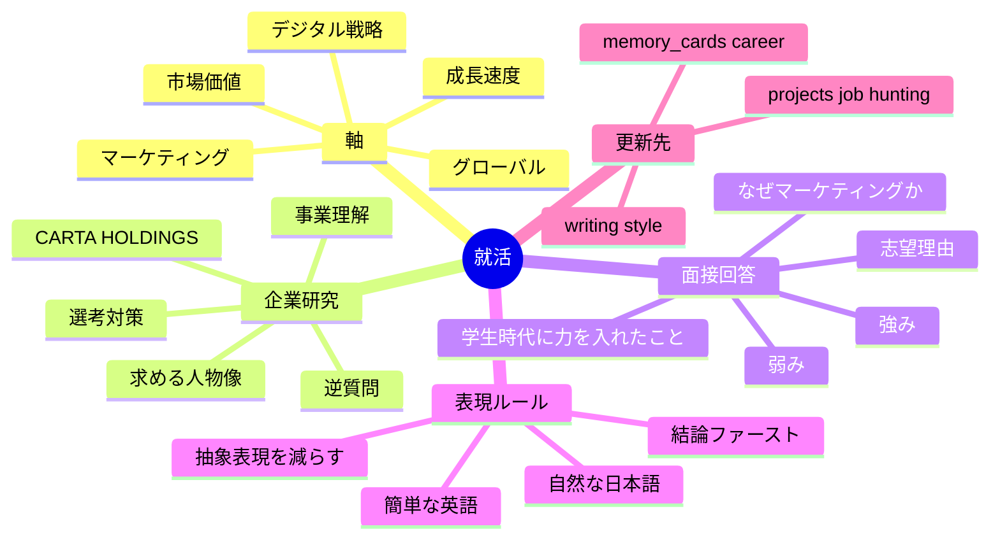

# Job Hunting Mindmap

就活で使う文脈を整理するマインドマップです。

```mermaid
mindmap
  root((就活))
    軸
      成長速度
      市場価値
      グローバル
      デジタル戦略
      マーケティング
    企業研究
      CARTA HOLDINGS
      事業理解
      求める人物像
      選考対策
      逆質問
    面接回答
      志望理由
      なぜマーケティングか
      学生時代に力を入れたこと
      強み
      弱み
    表現ルール
      自然な日本語
      簡単な英語
      結論ファースト
      抽象表現を減らす
    更新先
      memory_cards career
      projects job hunting
      writing style
```
