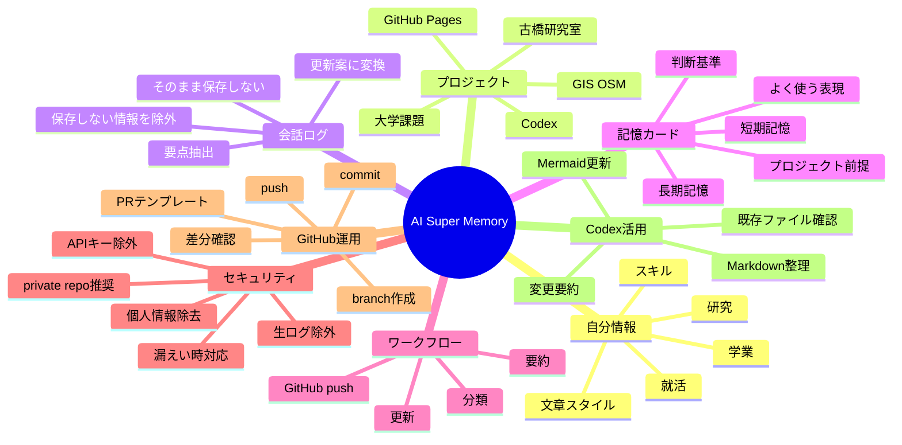

# Main Memory Mindmap

AI Super Memory全体の構造です。

```mermaid
mindmap
  root((AI Super Memory))
    自分情報
      学業
      研究
      就活
      スキル
      文章スタイル
    プロジェクト
      GitHub Pages
      Codex
      古橋研究室
      GIS OSM
      大学課題
    会話ログ
      そのまま保存しない
      要点抽出
      保存しない情報を除外
      更新案に変換
    記憶カード
      長期記憶
      短期記憶
      判断基準
      よく使う表現
      プロジェクト前提
    ワークフロー
      要約
      分類
      更新
      GitHub push
    セキュリティ
      個人情報除去
      APIキー除外
      生ログ除外
      private repo推奨
      漏えい時対応
    GitHub運用
      branch作成
      差分確認
      commit
      push
      PRテンプレート
    Codex活用
      既存ファイル確認
      Markdown整理
      Mermaid更新
      変更要約
```
